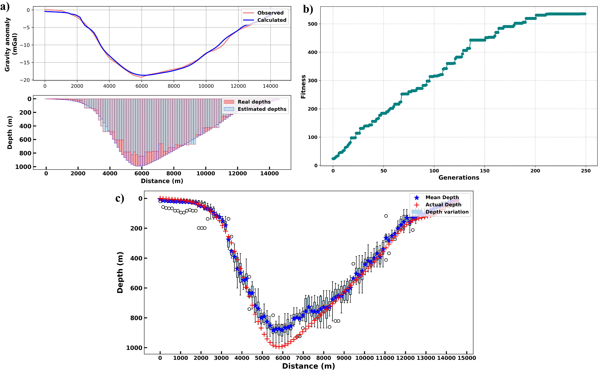

# Enhanced Subsurface Imaging from Multilayer Gravity Inversion Using Genetic Algorithm Approach

## Authors
- Ritesh Gond, Department of Applied Geophysics, Indian Institute of Technology (Indian School of Mines) Dhanbad, India
- Prof. Chandra Prakash Dubey, Department of Geology and Geophysics, Indian Institute of Technology, Kharagpur, India

## Project Overview
This Python-based inversion program uses a Genetic Algorithm (GA) to recover heterogeneous multilayer subsurface geometries from gravity anomaly data. Traditional inversion techniques often struggled with local minima, required manual tuning, and were computationally expensive. In contrast, our GA-based approach performs a global search to explore multiple potential solutions simultaneously, making it robust against local minima and more efficient in handling complex parameter spaces.

This tool can invert synthetic gravity data and real gravity anomalies, with special focus on sedimentary basins and structures with depth-varying density distributions. Sensitivity and uncertainty analyses are also incorporated to assess the model's stability and reliability.

## Features
- Global optimization through Genetic Algorithm (GA) for gravity inversion
- Avoids local minima by exploring multiple solutions simultaneously
- Recovery of multilayer heterogeneous subsurface geometries
- Sensitivity analysis for model parameter stability
- Uncertainty analysis using white Gaussian noise
- Application to both synthetic and real gravity data

## Prerequisites
Before running the program, ensure that you have the following installed:
- Python 3.x
- Required custom modules (PyGenetic, gravity_inversion). Keep these modules in the working directory along with the main file.
- Required libraries (can be installed using `requirements.txt`):
  pip install -r requirements.txt
  - numpy
  - matplotlib
  - scipy
  - pandas

## Usage
### Input Data
The input data consists of gravity anomaly measurements.
- Profile (observation points)
- Prism position and half width
- Gravity anomaly (gz)

### Customization
You can modify the inversion parameters such as the number of pools, genes, generations, boundary conditions, objective function from the custom modules.

### Output
The output includes:
- Recovered subsurface geometry
- Comparison of observed vs. modeled gravity data
- Sensitivity and uncertainty analyses results
- Variation of fitness values with generations

## Algorithm Details
The inversion algorithm is based on the Genetic Algorithm (GA), which leverages evolutionary operations such as selection, crossover, and mutation. This approach efficiently explores complex parameter spaces and avoids the pitfalls of local minima, which is common in conventional optimization techniques. 

The program models subsurface geometries as prisms, with varying densities across layers. Sensitivity analysis is performed to understand how variations in input parameters affect inversion results. The uncertainty of the model is tested by incorporating white Gaussian noise into the synthetic models, providing insights into the robustness of the inversion outcomes.

## Results
The Genetic Algorithm was successfully applied to both synthetic and real gravity anomaly data, yielding geologically reasonable models. The recovered subsurface geometries are consistent with previously reported results for real-world sedimentary basins.

